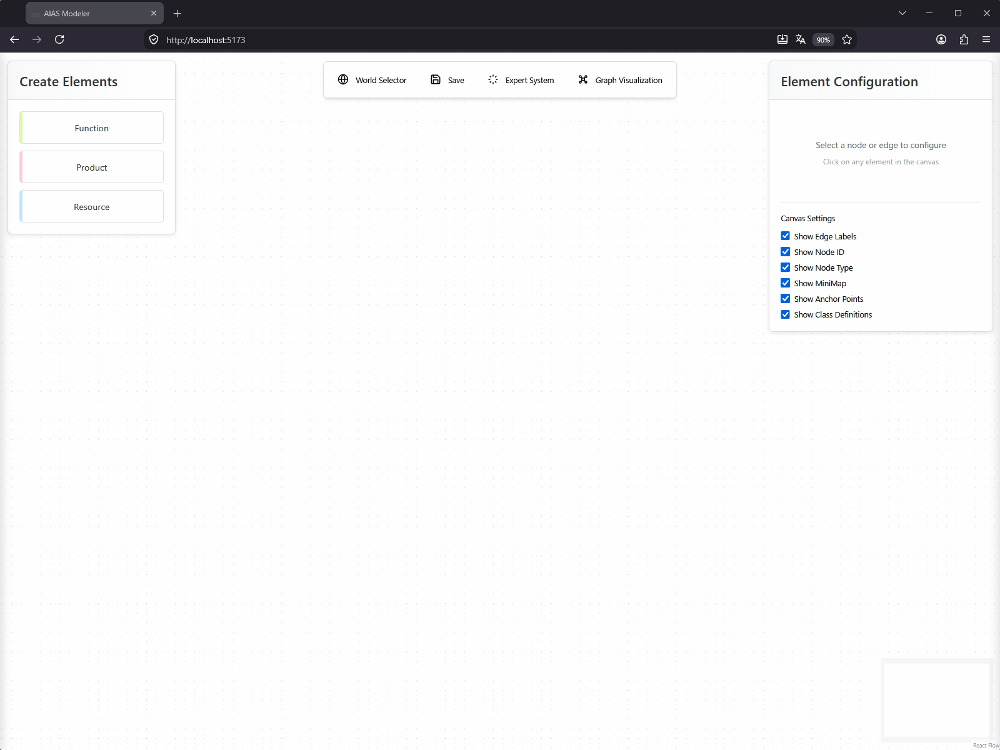
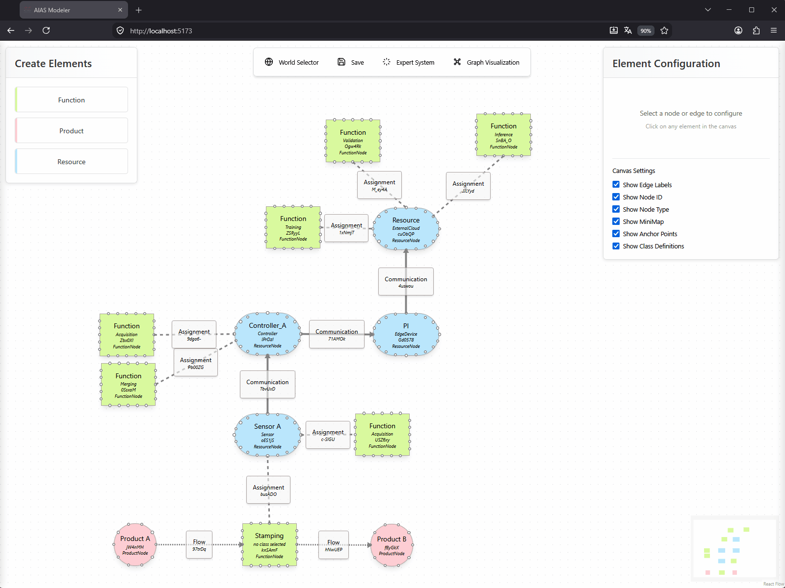
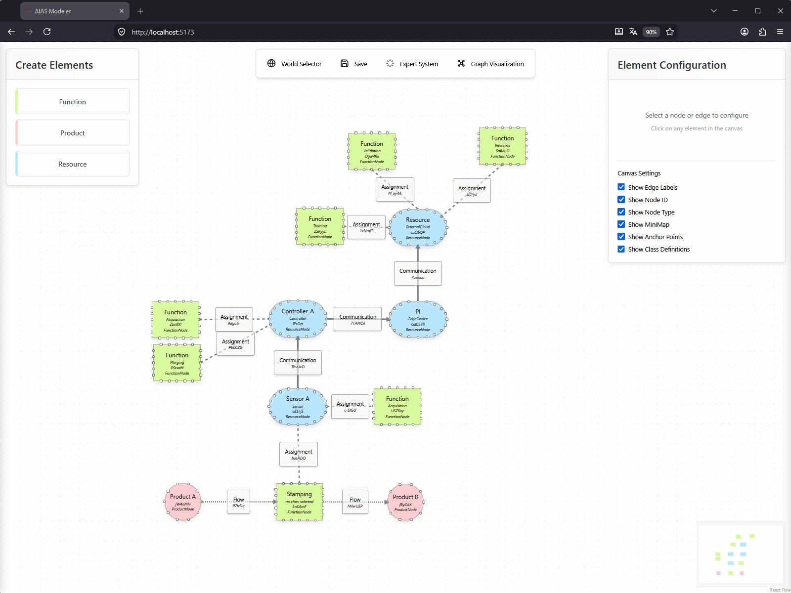

# Demonstration

Aufzeichnungen der Bedienung des AIAS-Modellierungswerkzeugs. Der Aufbau der
Oberfläche ist im [README](README.md#aufbau-der-oberfläche-und-bedienung) beschrieben; hier
sind die Abläufe in Bewegung zu sehen.

Die Aufzeichnungen sind ungekürzt und entsprechend groß (8–17 MB je Datei).
Beim Öffnen dieser Seite laden sie vollständig, das kann einen Moment dauern.

---

## Modellieren

Vom leeren Arbeitsbereich zum vollständigen Modell: Elemente anlegen, ihnen
Klassen aus der AIAS-Ontologie zuweisen, benennen und verbinden.

Zu sehen ist der Aufbau eines Stanzprozesses über alle drei Domänen hinweg —
der Produktfluss (Product A → Stamping → Product B), die Anlagenkomponenten
(Controller, Sensor, Edge-Gerät, externe Cloud) und die KI-Funktionen
(Acquisition, Training, Merging, Validation, Inference). Bei jeder Klassenwahl
blendet die Oberfläche die Definition aus der Ontologie samt Normquelle ein.

---

## Semantische Anreicherung

Elemente über das Annotationsfenster mit Eigenschaften und Beziehungen aus der
Ontologie versehen, die über die Graphstruktur hinausgehen.

Die Ontologie gibt vor, welche Beziehungen für die gewählte Klasse zulässig
sind, und staffelt sie nach Ebenen: Die übergeordnete Instanz muss jeweils
zuerst angelegt werden.

---

## Auswertung im Expertensystem

Die vier Auswertungsarten nacheinander: Reasoning mit dem Pellet-Reasoner,
SHACL-Konsistenzprüfung, hinweisgebende Regeln und die Suche in der Fallbasis.

---

## Projekte und Phasenmodelle

Verwaltung der Modellierungswelten: zwischen Projekten und Phasen wechseln, ein
Phasenmodell aus seinem Vorgänger ableiten und ein neues Projekt anlegen.

Abgeleitete Phasenmodelle übernehmen den Stand des Vorgängers, sodass der
Modellfortschritt über die Phasen der DMME-Methodik nachvollziehbar bleibt —
Ist-Modell (Phase 2), Konzept-Modell (Phase 3), Implementation-Modell (Phase 8)
und Deployment-Modell (Phase 9).

