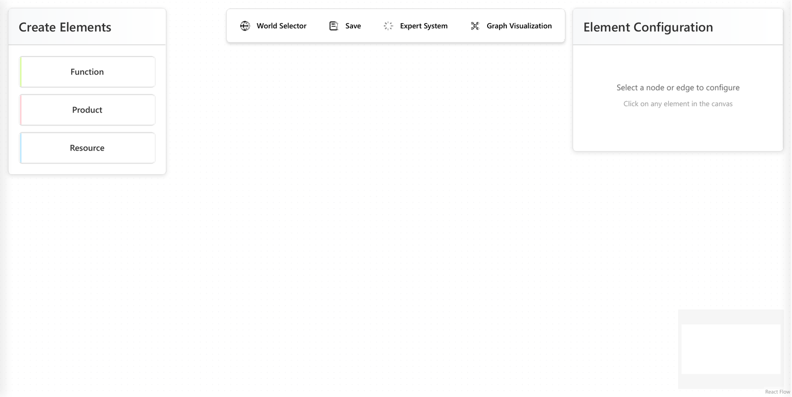
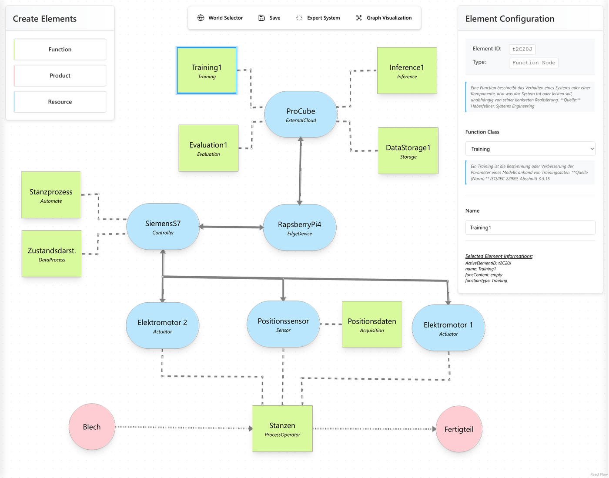
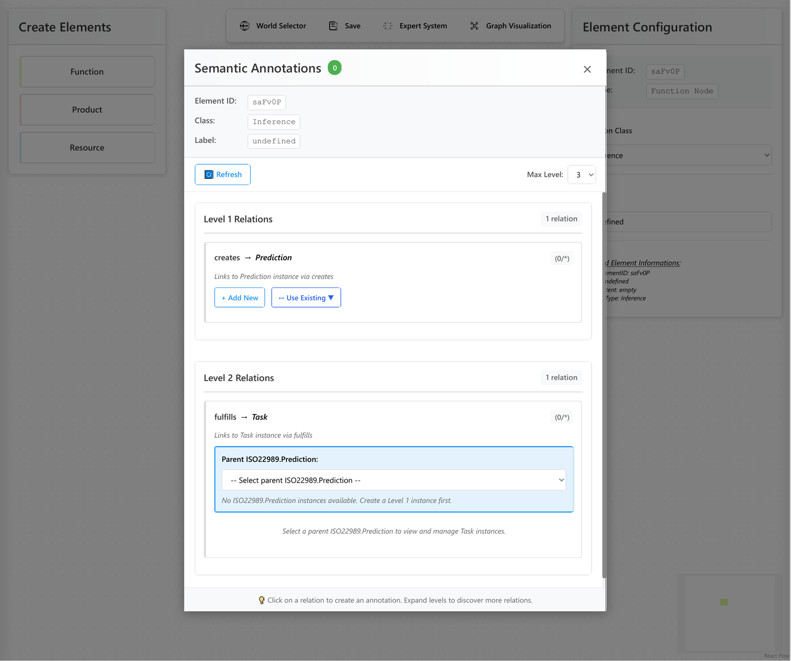
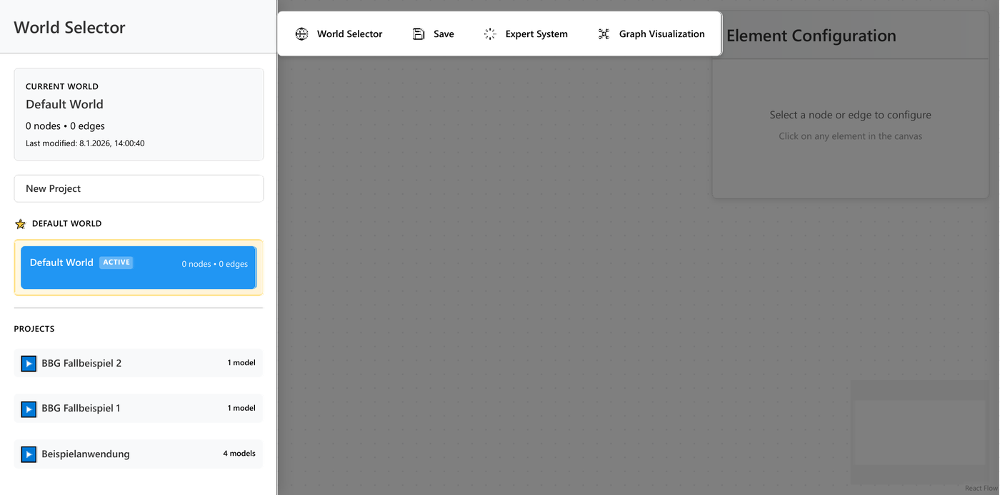
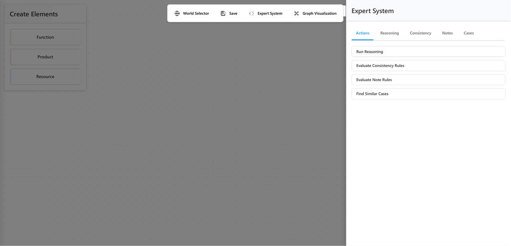
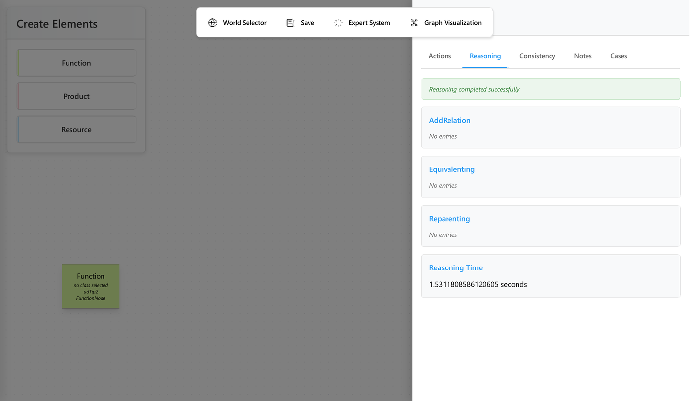
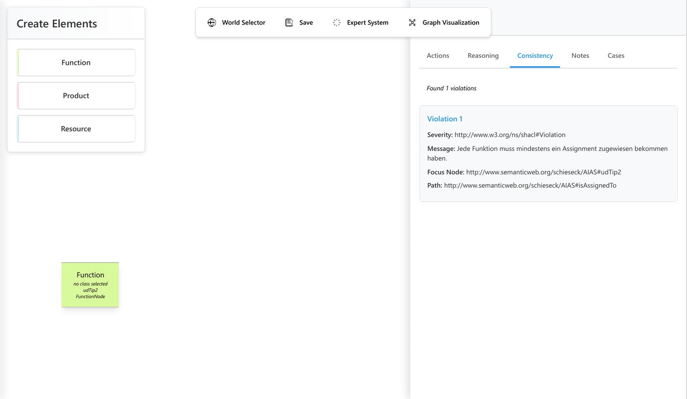
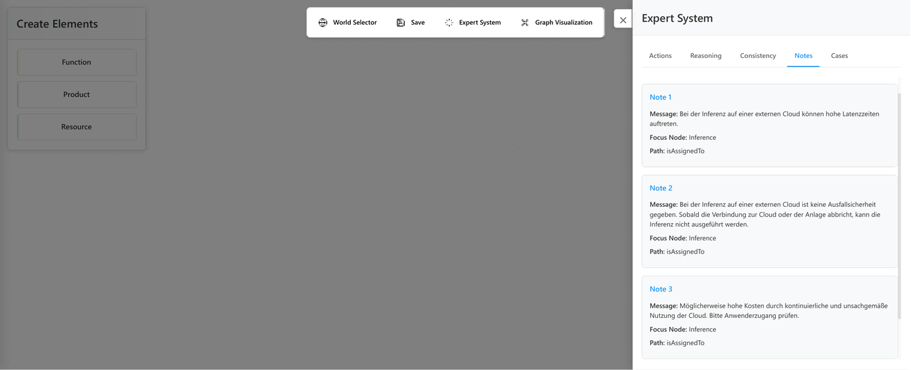
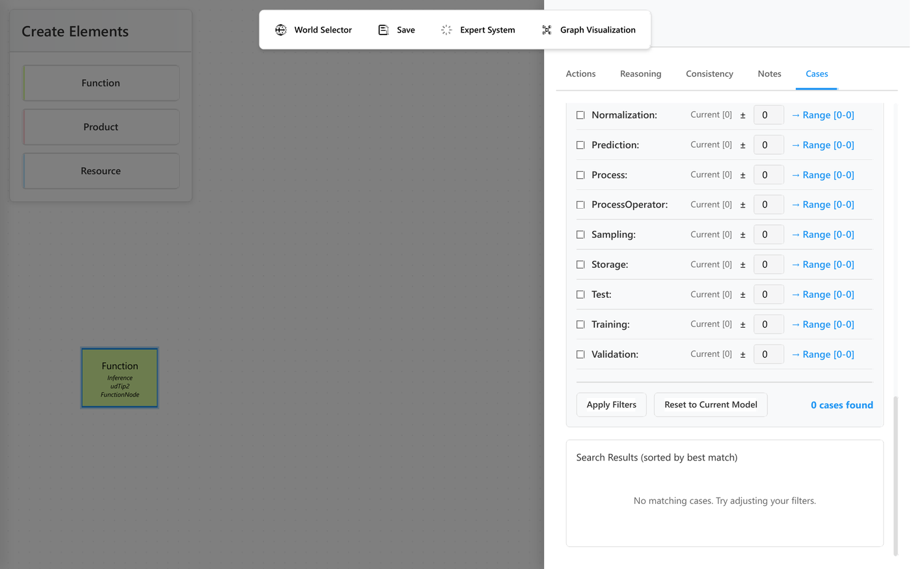
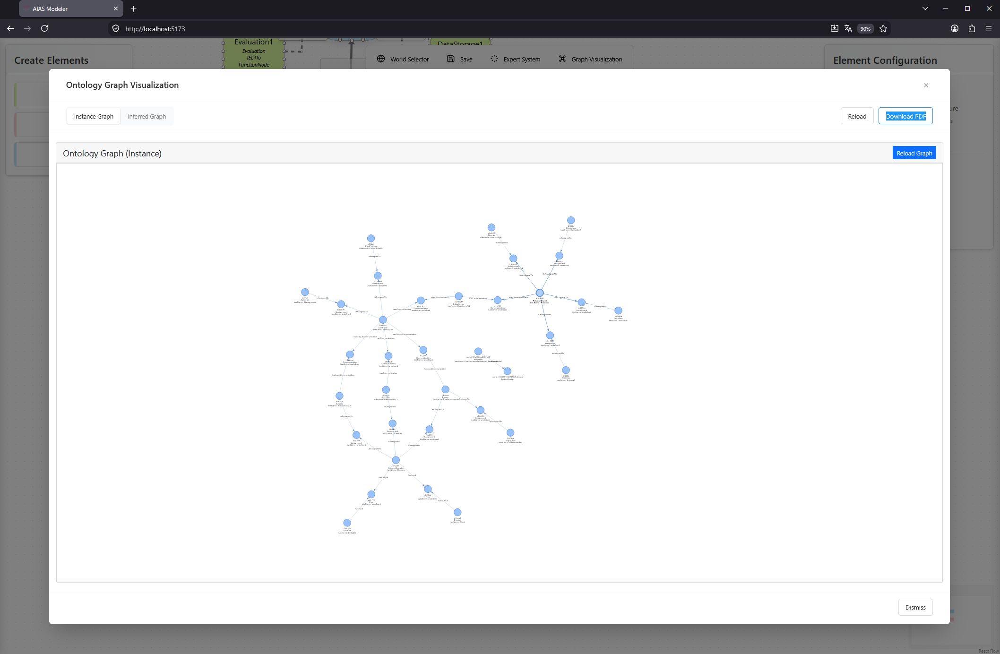

# AIAS Expert System

Ein web-basiertes Modellierungswerkzeug für die interdisziplinäre Modellierung
von KI-Systemen in automatisierten Anlagen. Das Werkzeug verbindet eine
grafische Modellierungssprache mit einer OWL-Wissensbasis und stellt
regelbasierte Prüfungen bereit, die das entstehende Modell auf Konsistenz,
Vollständigkeit und regulatorische Anforderungen hin auswerten.

Modelliert werden drei Domänen in einer gemeinsamen Darstellung: die
KI-/ML-Anteile (Funktionen, Modelle, Daten), die technische Anlage (Sensoren,
Aktoren, Steuerungen, Kommunikation) und der technische Prozess (Prozessoperatoren,
Produkte, Flüsse). Das grafische Modell wird fortlaufend in eine OWL-Ontologie
überführt, auf der Reasoner und Regelwerke arbeiten.

Das Werkzeug gehört zur eingereichten Dissertation von Marvin Schieseck
(Helmut-Schmidt-Universität / Universität der Bundeswehr Hamburg). Einzelheiten
dazu und zu den Vorarbeiten stehen unter
[Bezug zu Veröffentlichungen](#bezug-zu-veröffentlichungen).

---

## Architektur

```
┌─────────────────────────────────────────────────────┐
│  Frontend — React + ReactFlow                       │
│  Modellierungsfläche, Elementpanels, Zustand-Store  │
│  Port 5173 (Vite)                                   │
└─────────────────┬───────────────────────────────────┘
                  │ REST (HTTP/JSON)
┌─────────────────▼───────────────────────────────────┐
│  Backend — Flask + Python                           │
│  Ontologieverwaltung (owlready2), Reasoner-Anbindung│
│  Regelauswertung, fallbasiertes Schließen           │
│  Port 5000                                          │
└─────────────────┬───────────────────────────────────┘
                  │
┌─────────────────▼───────────────────────────────────┐
│  Wissensbasis                                       │
│  AIAS-Ontologie (OWL 2 DL)                          │
│  ODPs: ISO/IEC 22989, ISO/IEC 7498, VDI 3682        │
│  SWRL-Regeln · SHACL-Shapes · SPARQL-Abfragen       │
│  Fallbasis                                          │
└─────────────────────────────────────────────────────┘
```

**Frontend**: React 18, ReactFlow 11 für den Modellierungsgraphen, Zustand für
die Zustandsverwaltung, Tailwind CSS, Vite als Build-Werkzeug.

**Backend**: Flask, owlready2 für die OWL-Verwaltung und die Anbindung der
Reasoner Pellet und HermiT, rdflib und owlrl für RDF und Inferenz, pyshacl für
die SHACL-Prüfung, PyVis für die interaktive Graphdarstellung.

**Wissensrepräsentation**: OWL 2 DL für das Informationsmodell, SWRL für
Inferenzregeln, SHACL für strukturelle Randbedingungen, SPARQL für
auswertende Abfragen.

---

## Aufbau des Repositorys

```
backend/
  server.py                     Einstiegspunkt Flask
  configData.json               Adressen, Ports, Routen
  requirements.txt              Python-Abhängigkeiten
  routes/                       REST-Endpunkte
  expert_system/
    reasoning.py                Reasoner-Anbindung (siehe LICENSE)
    modules/                    Fachlogik: Ontologie-, Welt-, Regelverwaltung
    ontologies/                 AIAS-Ontologie und ODPs
    rule_base/                  SWRL-, SHACL- und SPARQL-Regeln
    case_base/                  Fallbasis
  modeling-worlds/              Gespeicherte Modellierungswelten
  lib/                          Von PyVis mitgelieferte JS-Bibliotheken

frontend/
  src/
    App.jsx                     Wurzelkomponente
    store.js                    Zustandsverwaltung
    components/
      nodes/                    Knotentypen
      edges/                    Kantentypen
      panels/                   Bedienpanels
    utils/                      API-Aufrufe, Validierung, Geometrie

figures/                        Abbildungen dieser Dokumentation
```

---

## Wissensbasis

### Ontologien

`backend/expert_system/ontologies/`

- **AIAS.owl** — das Informationsmodell: Klassen und Eigenschaften für
  KI-Systeme, Anlagenkomponenten und technische Prozesse
- **odps/ISO22989.owl** — Begriffe der KI nach ISO/IEC 22989
- **odps/ISO7489.owl** — Kommunikationsschichten nach dem OSI-Referenzmodell
  (ISO/IEC 7498; der Dateiname enthält einen Zahlendreher, der aus
  Kompatibilitätsgründen beibehalten wurde)
- **odps/VDI3682.owl** — formalisierte Prozessbeschreibung nach VDI 3682

### Regelwerk

`backend/expert_system/rule_base/`

- **swrl_rules.txt** — SWRL-Regeln, die beim Reasoning angewendet werden
- **shacl_rules_consistency.ttl** — SHACL-Shapes für die strukturelle Prüfung
- **shacl_rules_notes.ttl** — Regeln für die hinweisgebende Auswertung
- **sparql_rules_notes.json** — SPARQL-basierte Hinweisregeln
- **human_readable_notes.txt** — alle Hinweisregeln in WENN-DANN-Form

Das Regelwerk deckt neben strukturellen und fachlichen Prüfungen auch
Anforderungen aus der KI-Verordnung (EU) 2024/1689 und der DSGVO ab.

---

## Hinweis zum Charakter der Software

Es handelt sich um einen **Forschungsprototyp**, der im Rahmen einer Dissertation
entstanden ist. Das Werkzeug dient dazu, den in der Arbeit beschriebenen Ansatz
nachvollziehbar und überprüfbar zu machen. Es ist nicht für den produktiven
Einsatz ausgelegt: Fehlerbehandlung, Mehrbenutzerbetrieb, Zugriffsschutz und
Langzeitstabilität sind nicht Gegenstand der Entwicklung. Der Server ist für den
lokalen Betrieb gedacht und sollte nicht ungeschützt über ein Netz erreichbar
gemacht werden.

---

## Installation

### Voraussetzungen

- **Python** 3.10 oder neuer (benötigt wird das `match`-Statement)
- **Node.js** 18 oder neuer
- **Java** (JRE 8 oder neuer) — wird von owlready2 für die Reasoner Pellet und
  HermiT benötigt. Ohne Java arbeitet das Werkzeug, die Reasoning-Funktion
  steht dann jedoch nicht zur Verfügung.

Die folgenden Schritte sind einmalig einzurichten. Das Starten der Anwendung
im Alltag ist im Abschnitt [Start](#start) beschrieben.

### Backend einrichten

```bash
cd backend

python -m venv .venv

# Windows
.venv\Scripts\activate
# Linux/macOS
source .venv/bin/activate

pip install -r requirements.txt

# Browser für den PDF-Export der Graphansichten
python -m playwright install chromium
```

### Frontend einrichten

```bash
cd frontend
npm install
```

---

## Start

Die Anwendung besteht aus zwei Prozessen, die **gleichzeitig** laufen müssen.
Dafür werden zwei Terminals benötigt.

**Terminal 1 — Backend:**

```bash
cd backend

# Windows
.venv\Scripts\activate
# Linux/macOS
source .venv/bin/activate

python server.py
```

Der Start ist erfolgreich, wenn die Ausgabe mit einer Meldung wie dieser endet:

```
✅ Server initialization complete
   Ontology loaded: True
   Individuals count: 49
```

Das Backend hört dann auf `http://127.0.0.1:5000`.

**Terminal 2 — Frontend:**

```bash
cd frontend
npm run dev
```

Vite meldet die Adresse, unter der die Oberfläche erreichbar ist:

```
  ➜  Local:   http://127.0.0.1:5173/
```

**Anschließend** den Browser unter [http://127.0.0.1:5173](http://127.0.0.1:5173)
öffnen. Beim ersten Aufruf wird die Default-Welt geladen.

Beendet werden beide Prozesse mit `Strg+C` im jeweiligen Terminal. Die
Aktivierung der virtuellen Umgebung im Backend-Terminal ist bei jedem Start
erneut nötig, die Installation der Abhängigkeiten dagegen nicht.

### Adressen und Ports

Beide Prozesse sind auf den lokalen Betrieb unter `127.0.0.1` voreingestellt.
Das Backend liest Adresse und Port aus `backend/configData.json`, das Frontend
aus `frontend/vite.config.js`.

Die Adresse, unter der das Frontend das Backend anspricht, ist derzeit an
mehreren Stellen im Quelltext fest hinterlegt — in `src/App.jsx`, `src/store.js`,
`src/utils/annotationUtils.js` und `src/components/modals/GraphVisualizationModal.jsx`.
Wird der Backend-Port geändert, ist er dort ebenfalls anzupassen.

---

## Aufbau der Oberfläche und Bedienung

Die Oberfläche gliedert sich in vier Bereiche, die den Arbeitsablauf abbilden:
Modelle verwalten, modellieren, semantisch anreichern und auswerten. Die
folgenden Abbildungen zeigen den jeweiligen Bereich; bewegte Aufzeichnungen der
Bedienung stehen in [DEMONSTRATION.md](DEMONSTRATION.md).

Die Abbildungen dieses Abschnitts stammen aus der zugrunde liegenden
Dissertation.

### Modellierungsfläche



Die Arbeitsfläche nimmt den mittleren Bereich ein. Links werden über *Create
Elements* neue Elemente angelegt, rechts zeigt das *Element Configuration*-Panel
die Eigenschaften des gewählten Elements. Die Kopfleiste führt zu den übrigen
Bereichen: Weltenverwaltung, Speichern, Expertensystem und Graphansicht.

### Modellieren



Ein fertiges Modell verbindet die drei Domänen in einer Darstellung. Im Beispiel
eines Stanzprozesses sind zu sehen:

- **Produkte** (rot) und der Prozessfluss: Blech → Stanzen → Fertigteil
- **Ressourcen** (blau) der Anlage: SiemensS7-Steuerung, RaspberryPi4 als
  Edge-Gerät, Positionssensor, Elektromotoren, eine externe Cloud
- **Funktionen** (grün) aus beiden Welten: der Prozess selbst
  (*Stanzprozess*, *Zustandsdarstellung*) und die KI-Anteile
  (*Training*, *Inference*, *Evaluation*, *DataStorage*)

Für jedes Element wird eine Klasse aus der AIAS-Ontologie gewählt. Die
Oberfläche zeigt dazu die Definition der Klasse samt Quelle an — im Beispiel
für *Training* der Verweis auf ISO/IEC 22989, Abschnitt 3.3.15. Verbindungen
werden gegen die Elementtypen geprüft, unzulässige Kombinationen weist die
Oberfläche zurück.

### Semantische Anreicherung



Über das Annotationsfenster erhalten Elemente Eigenschaften und Beziehungen, die
über die Graphstruktur hinausgehen. Die Ontologie gibt dabei vor, welche
Beziehungen für die gewählte Klasse zulässig sind, und staffelt sie nach Ebenen:
Eine *Inference* erzeugt auf Ebene 1 eine *Prediction*, diese erfüllt auf Ebene 2
eine *Task*. Die jeweils übergeordnete Instanz muss zuerst angelegt werden, was
die Oberfläche durchsetzt.

### Weltenverwaltung



Modelle werden in *Welten* verwaltet, die zu Projekten gruppiert sind. Jede Welt
entspricht einer Phase der DMME-Methodik: Ist-Modell (Phase 2), Konzept-Modell
(Phase 3), Implementation-Modell (Phase 8) und Deployment-Modell (Phase 9). Ein
Phasenmodell wird aus seinem Vorgänger abgeleitet und übernimmt dessen Stand, so
dass der Modellfortschritt über die Phasen nachvollziehbar bleibt.

### Expertensystem



Das Expertensystem wertet das Modell auf vier Arten aus. Der Reiter *Actions*
fasst die Funktionen zusammen:



**Reasoning** startet den Pellet-Reasoner. Implizite Beziehungen und
Klassenzugehörigkeiten werden abgeleitet und die SWRL-Regeln angewendet; das
Ergebnis steht als abgeleitetes Modell zur Verfügung.



**Consistency** prüft mit SHACL gegen strukturelle Randbedingungen und meldet
Verletzungen mit dem betroffenen Pfad.



**Notes** gibt Hinweise, die keine harten Fehler sind, sondern auf Lücken und
Risiken aufmerksam machen. Im Beispiel einer Inferenz in einer externen Cloud:
mögliche Latenzzeiten, fehlende Ausfallsicherheit bei Verbindungsabbruch und
Kostenrisiken. Jeder Hinweis nennt den betroffenen Knoten und den Pfad, über den
die Regel gegriffen hat.



**Cases** durchsucht die Fallbasis nach ähnlichen Architekturen. Über Filter auf
Komponenten- und Funktionstypen lassen sich vergleichbare Fälle finden und als
Referenz heranziehen.

### Graphansicht



Über *Graph Visualization* lässt sich die Ontologie einsehen, in die das
grafische Modell überführt wurde. Der Reiter *Instance Graph* zeigt die
modellierten Individuen mit ihren Beziehungen, *Inferred Graph* das Ergebnis
nach einem Reasoning-Lauf mit den zusätzlich abgeleiteten Aussagen. Die
Darstellung lässt sich verschieben und zoomen; über *Download PDF* wird sie
exportiert.

Diese Ansicht zeigt, was tatsächlich in der Wissensbasis steht — anders als die
Modellierungsfläche, die die grafische Sicht darauf bietet.

---

## Lizenz

MIT — siehe [LICENSE](LICENSE).

Die Datei `backend/expert_system/reasoning.py` ist von Owlready2 abgeleitet und
steht unter der LGPL-3.0. Die Bibliotheken unter `backend/lib/` werden von PyVis
mitgeliefert und stehen unter ihren jeweiligen Lizenzen. Einzelheiten dazu
stehen in der Lizenzdatei.

---

## Autor

Marvin Schieseck
Helmut-Schmidt-Universität / Universität der Bundeswehr Hamburg
Professur für Automatisierungstechnik

Kontakt: <marvin.schieseck@hsu.hamburg> oder <marvin.schieseck@gmx.de>

---

## Bezug zu Veröffentlichungen

### Dissertation

> **Vorläufige Angaben.** Die Dissertation ist eingereicht, das
> Promotionsverfahren aber noch nicht abgeschlossen. Die bibliografischen
> Angaben in diesem Abschnitt und unter [How to Cite](#how-to-cite) werden
> ergänzt, sobald die Arbeit veröffentlicht ist.

Dieses Repository stellt das Modellierungswerkzeug bereit, das in der folgenden
Arbeit entwickelt und evaluiert wird:

> Marvin Schieseck: **Modellgestütztes Engineering von Künstlicher Intelligenz
> für automatisierte Anlagen**. Eingereichte Dissertation,
> Helmut-Schmidt-Universität / Universität der Bundeswehr Hamburg.

Die zugehörigen Ontologien sind unter
[`https://w3id.org/aias/1.0.0`](https://w3id.org/aias/1.0.0) dauerhaft publiziert
und dort zu zitieren. Die in `backend/expert_system/ontologies/` mitgelieferten
OWL-Dateien sind die Arbeitskopien, mit denen das Werkzeug lokal rechnet; sie
tragen noch die Namensräume der Entwicklungsumgebung
(`http://www.semanticweb.org/schieseck/…`) und sind inhaltlich, nicht in der
IRI-Vergabe, mit der publizierten Fassung deckungsgleich.

### Vorarbeiten

Die Bausteine des hier umgesetzten Ansatzes wurden vorab veröffentlicht. Jeder
Baustein ist in einem eigenen Repository verfügbar.

#### Informationsmodell

Die formale Beschreibung des AIAS-Informationsmodells, auf dem die Ontologien
dieses Werkzeugs beruhen.

> M. Schieseck, P. Topalis, L. Reinpold, F. Gehlhoff and A. Fay: *A Formal
> Model for Artificial Intelligence Applications in Automation Systems*.
> In: 2024 IEEE 29th International Conference on Emerging Technologies and
> Factory Automation (ETFA). Padova, IT, 2024.
> DOI: [10.1109/ETFA61755.2024.10710890](https://doi.org/10.1109/ETFA61755.2024.10710890)

Repository: [github.com/schiesem/aias-information-model](https://github.com/schiesem/aias-information-model)

#### Grafische Modellierungssprache

Die Sprache GML-AIAAS, deren Knoten- und Kantentypen die Modellierungsfläche
dieses Werkzeugs umsetzt.

> M. Schieseck, P. Topalis and A. Fay: *A Graphical Modeling Language for
> Artificial Intelligence Applications in Automation Systems*.
> In: 2023 IEEE 21st International Conference on Industrial Informatics
> (INDIN). Lemgo, DE, 2023.
> DOI: [10.1109/INDIN51400.2023.10217890](https://doi.org/10.1109/INDIN51400.2023.10217890)

Repository: [github.com/schiesem/GML-AIAAS](https://github.com/schiesem/GML-AIAAS)

#### Werkzeug

Der webbasierte Werkzeugansatz, aus dem die hier vorliegende Implementierung
hervorgegangen ist.

> M. Schieseck, P. Topalis und A. Fay: *Webbasiertes Werkzeug für das
> modellbasierte Engineering von KI-Anwendungen für Automatisierungssysteme*.
> In: 18. Fachtagung EKA 2024 – Entwurf komplexer Automatisierungssysteme.
> Magdeburg, DE: Otto von Guericke University Library, 2024.
> DOI: [10.25673/116055](https://doi.org/10.25673/116055)

Repository: [github.com/schiesem/ai-modeling-tool](https://github.com/schiesem/ai-modeling-tool)

#### Regelkonzepte

Die Konzepte zur regelbasierten Wissensverarbeitung, die der SWRL- und
SHACL-Auswertung dieses Werkzeugs zugrunde liegen.

> C. Sieber, M. Schieseck, P. Pohlmann, P. Schönberg und A. Fay:
> *Automatisiertes Wissensmanagement in verteilten Systemen zur Laufzeit*.
> In: 25. Leitkongress Automation 2024: AI beats Automation?
> Baden-Baden, DE: VDI Verlag, 2024, S. 435–450.
> DOI: [10.51202/9783181024379-435](https://doi.org/10.51202/9783181024379-435)

Repository: [github.com/schiesem/swrl-rule-editor](https://github.com/schiesem/swrl-rule-editor)

Die regel- und fallbasierten Teilsysteme gehen auf zwei Abschlussarbeiten
zurück, die im Rahmen dieser Arbeit betreut wurden:

> P. Pohlmann: *Regelbasiertes System zur Unterstützung der Modellierung von
> ML-Software für Automatisierungssysteme*. Bachelorarbeit,
> Helmut-Schmidt-Universität / Universität der Bundeswehr Hamburg,
> Dezember 2023.

> P. Schönberg: *Fallbasiertes System zur Unterstützung der Modellierung von
> ML-Software für Automatisierungssysteme*. Bachelorarbeit,
> Helmut-Schmidt-Universität / Universität der Bundeswehr Hamburg,
> Dezember 2023.

---

## How to Cite

Wird dieses Werkzeug in einer wissenschaftlichen Arbeit verwendet, ist die
zugrunde liegende Dissertation zu zitieren. Sie befindet sich derzeit im
Veröffentlichungsprozess; die Angaben werden ergänzt, sobald sie vorliegen.

**Zitation:**

M. Schieseck: Modellgestütztes Engineering von Künstlicher Intelligenz für
automatisierte Anlagen. Dissertation, Helmut-Schmidt-Universität /
Universität der Bundeswehr Hamburg, Hamburg, DE. In Veröffentlichung.

**BibTeX:**

```bibtex
@phdthesis{schieseck-aias-expert-system,
  author  = {Schieseck, Marvin},
  title   = {Modellgest{\"u}tztes Engineering von K{\"u}nstlicher Intelligenz
             f{\"u}r automatisierte Anlagen},
  school  = {Helmut-Schmidt-Universit{\"a}t / Universit{\"a}t der Bundeswehr Hamburg},
  address = {Hamburg, DE},
  year    = {2026},
  note    = {In Ver{\"o}ffentlichung}
}
```

Wird gezielt auf einen einzelnen Baustein Bezug genommen, ist zusätzlich die
jeweilige Veröffentlichung aus dem Abschnitt
[Vorarbeiten](#vorarbeiten) anzugeben.

